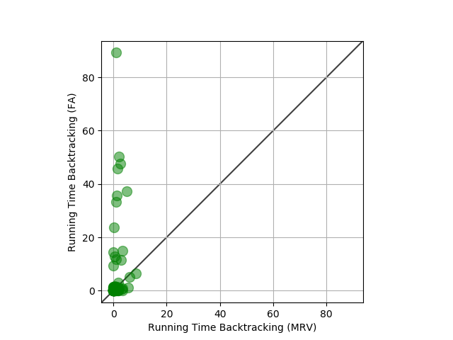

# Sudoku-Solver
Implemented Backtracing and AC3 Algorithms to solving sudoku puzzle.

## Adding thhis number

003020600900305001001806400008102900700000008006708200002609500800203009005010300
200080300060070084030500209000105408000000000402706000301007040720040060004010003

### How to run:
```
pip install -r requirements.txt
python3 sudoku_solver_rohit.py
```

### Results
MRV - minimum remaining heuristic vs FA (first available)

